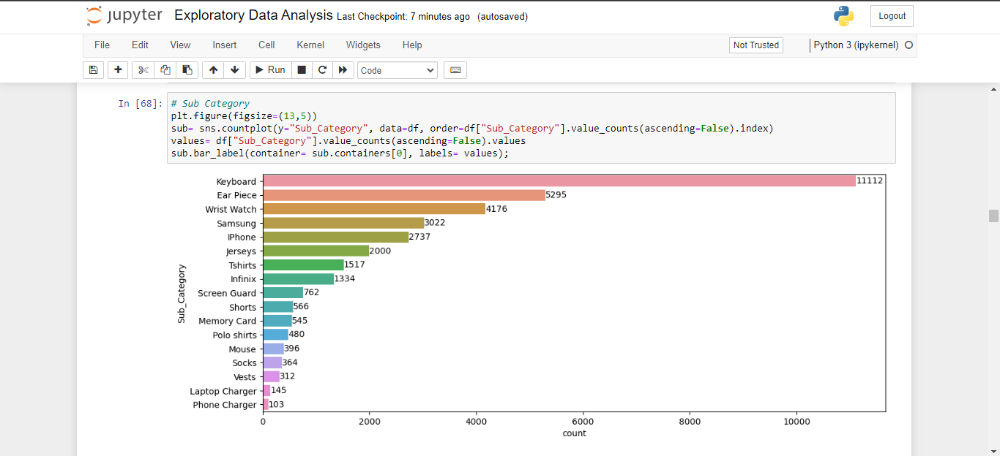
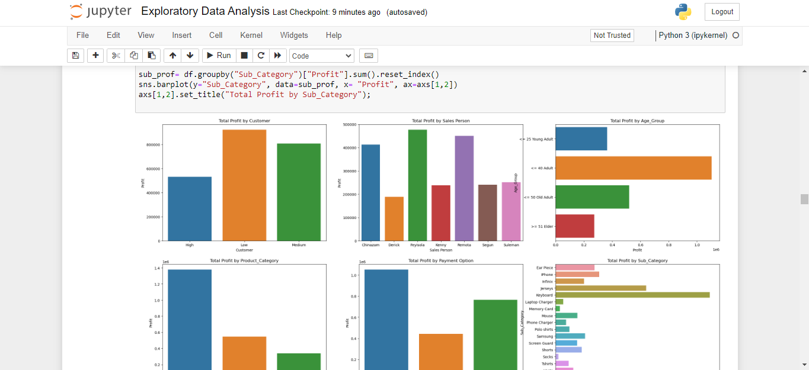
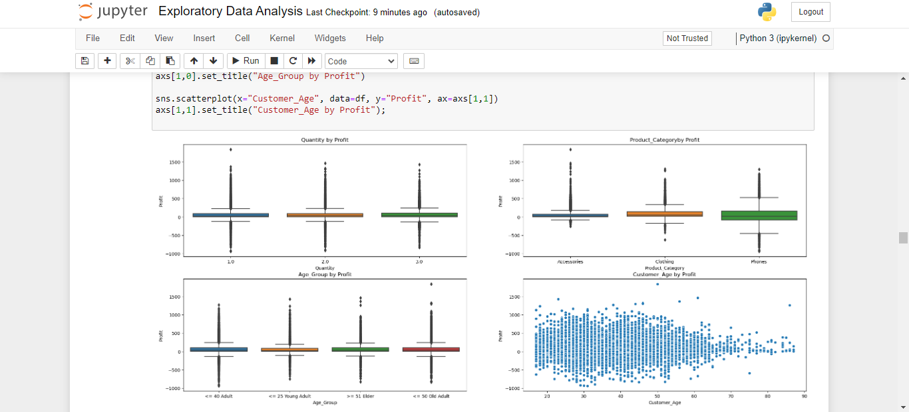
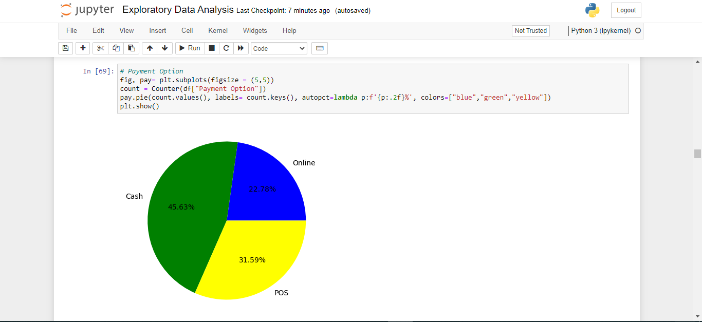
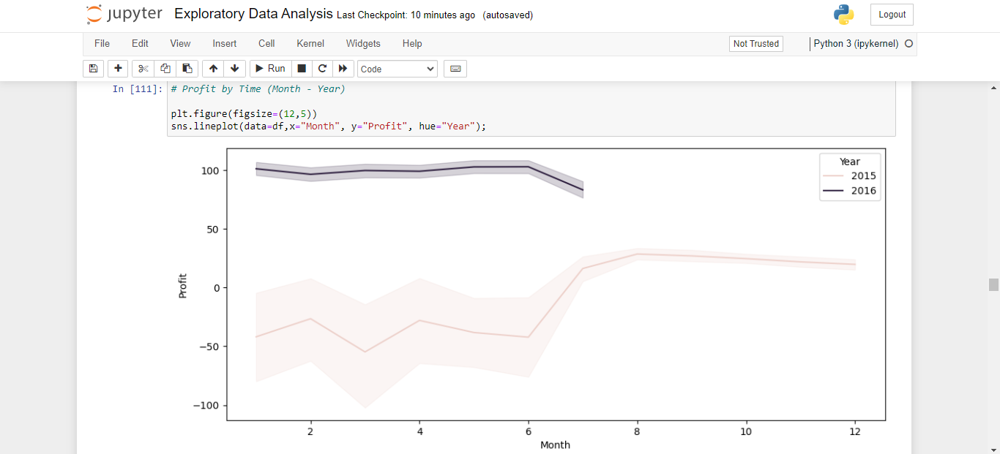
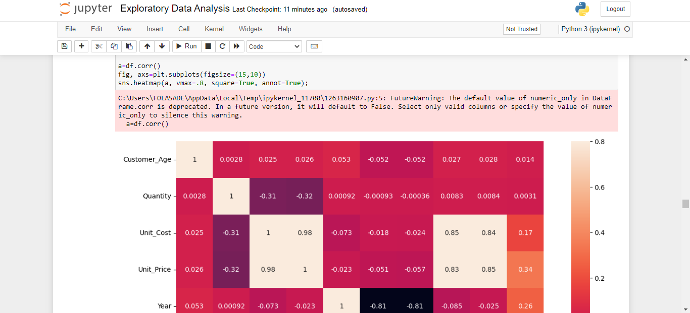
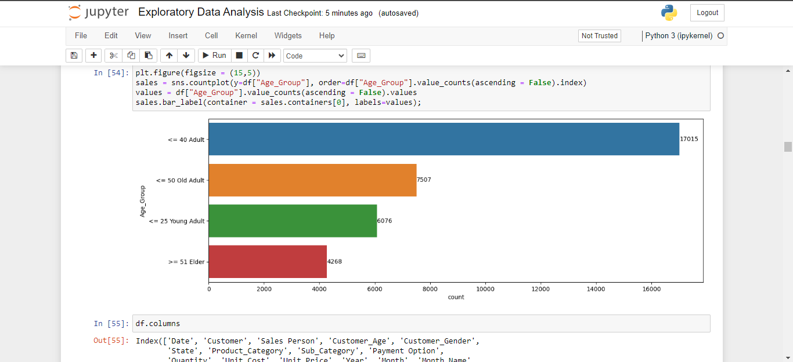
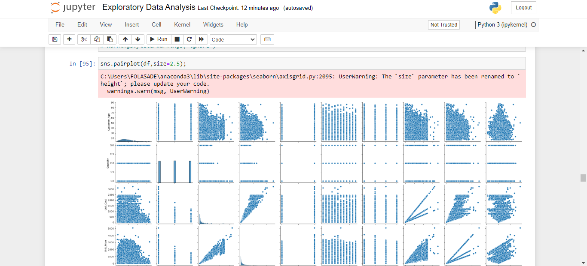
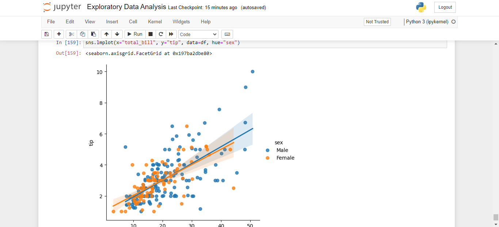
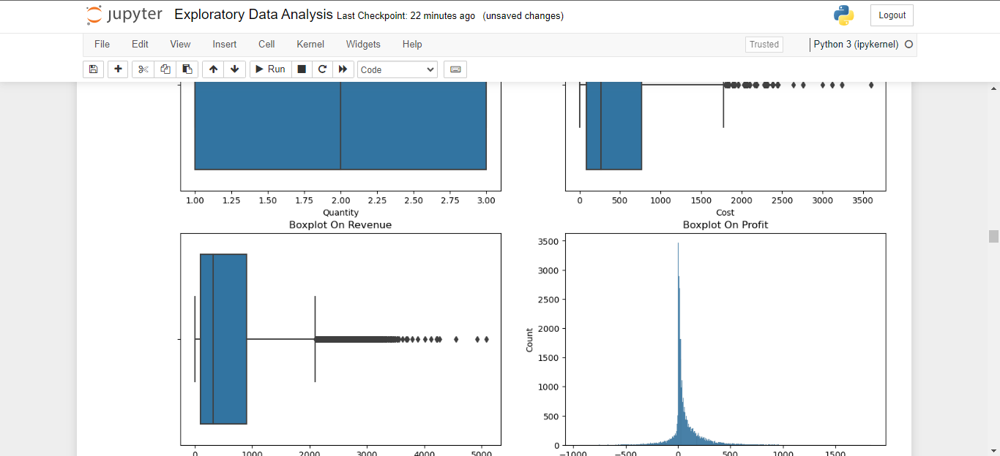

## Visualizing Sales Data with Powerful Libraries: Exploratory Data Analysis Made Easy.
#### Elevate your exploratory data analysis (EDA) to new heights with this repository! Harness the power of libraries like missingno (msno), seaborn (sns), matplotlib.pyplot (plt), collections.Counter (Counter), and pandas (pd) to unlock invaluable insights from your sales dataset. From handling missing values and creating stunning visualizations to analyzing customer preferences and product distribution, our code samples demonstrate the versatility and efficiency of these libraries. Take charge of your sales analysis today and dive into the world of data-driven decision-making. Explore this repository now for an immersive EDA experience!

 

 

 

